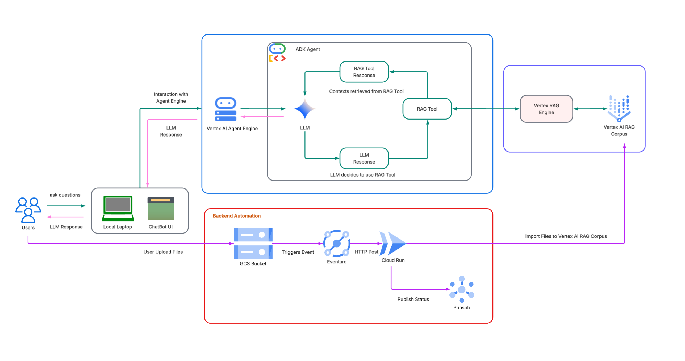

# Self-Updating RAG AI Chatbot with Vertex AI Agent Engine

This repository contains an end-to-end prototype/sample implementation of a **Retrieval-Augmented Generation (RAG) AI Chatbot** designed to answer questions based on your internal documents.

It leverages the **Vertex AI RAG Engine** to fetch relevant documentation snippets and **Gemini** to synthesize accurate, cited answers. Furthermore, it solves the problem of stale data by implementing a **"living" knowledge base**: an automated pipeline that updates the RAG Corpus instantly whenever a new document is added to Google Cloud Storage.

---

## 🚀 Key Features

* **Managed RAG Infrastructure:** Uses Vertex AI’s managed Corpus, eliminating the need to manage your own vector database.
* **Serverless Agent Deployment:** Deploys agent logic to **Vertex AI Agent Engine**, handling scaling and reasoning infrastructure automatically.
* **Google ADK Integration:** Built with the Agent Development Kit (ADK) for modular, type-safe agent construction.
* **Event-Driven Automation:** Automatically indexes new files uploaded to GCS using Eventarc and Cloud Run.
* **Secure IAM Authentication:** Uses Service Accounts and custom roles instead of fragile API keys.
* **Decoupled Frontend:** A custom Gradio UI that connects remotely to the cloud agent.

---

## 🏗️ RAG AI Chatbot High-Level Architecture



---

## 🛠️ Prerequisites

* **Google Cloud Project** with billing enabled.
* **Python 3.10+** installed.
* **Git** installed.
* **gcloud CLI** installed and authenticated.
* **uv**: An extremely fast Python package installer and resolver.

## Install `uv`
```bash
curl -LsSf https://astral.sh/uv/install.sh | sh
```
## 1. Setup & Installation

1. Project Setup
Clone the repository and install dependencies using uv.

```bash
git clone https://github.com/dvamsy/self-updating-rag-ai-chatbot.git
cd self-updating-rag-ai-chatbot/rag-prototype
```
## Install dependencies
```bash
uv sync
```
## Activate the virtual environment
```bash
source .venv/bin/activate
```
## 2. Environment Configuration
Rename the example environment (.env) file and configure your project details.

```bash
cp .env.example .env
```
Open .env and ensure the following variables are set:
```bash
GOOGLE_CLOUD_PROJECT=your-project-id
GOOGLE_CLOUD_LOCATION=asia-southeast1  # or us-central1
```

## 3. Provision RAG Corpus & GCS
Run the setup script to create the GCS buckets (Source & Staging) and the Vertex AI RAG Corpus. By default, this downloads Alphabet's 2024 10-K PDF and indexes it.

# Authenticate first
```bash
gcloud auth application-default login
```
# Enable required API (wait 1 minute after running this)
```bash
gcloud services enable aiplatform.googleapis.com --project=<YOUR_PROJECT_ID>
```
# Run the provision script
```bash
uv run python data-load-to-corpus/data_load_to_corpus.py
```
This script will automatically update your .env file with SOURCE_GCS_BUCKET, STAGING_BUCKET, and RAG_CORPUS.

## 3. 🤖 Deploying the Agent
1. Configure Agent Code
⚠️ IMPORTANT: The deployed agent runs in a secure cloud environment and cannot access your local .env file. You must hardcode the Corpus ID.

Open ai_agent/agent.py and update the rag_corpus field:

```python


ask_vertex_retrieval = VertexAiRagRetrieval(
    # ...
    rag_resources=[
        rag.RagResource(
            # Copy the value of RAG_CORPUS from your .env file and paste it here
            rag_corpus="projects/123.../locations/.../ragCorpora/456..." 
        )
    ],
    # ...
)
```
2. Deploy to Agent Engine
Deploy the agent to Vertex AI. This packages your code and provisions the infrastructure.

```bash
uv run python ai_agent/vertex_engine_deploy/deploy.py
```
3. Grant Permissions
Connect the Agent Engine (Compute) to the RAG Corpus (Data) using IAM.
```bash
chmod +x ai_agent/vertex_engine_deploy/grant_permissions.sh
./ai_agent/vertex_engine_deploy/grant_permissions.sh
```
4. Smoke Test
Verify the agent is live and answering questions via the terminal.
```bash
uv run python ai_agent/vertex_engine_deploy/run.py
```
5. 💬 Running the Frontend
Launch the Gradio Chat interface locally.

Add frontend dependencies if missing
```bash
uv add gradio uvicorn fastapi python-dotenv google-cloud-aiplatform
```
Run the UI
```bash
uv run python ./frontend-ui/app_ui.py
```
Access the UI at http:// URL you will get after running the above command.

## 🔄 Setting up Automation (Self-Updating)
Deploy the backend worker that listens for file uploads and updates the RAG Corpus automatically.

1. Fix Build Permissions
Grant Cloud Build and Eventarc permissions to your project's default service accounts.

```bash
# Get Project ID and Number
PROJECT_ID=$(gcloud config get-value project)
PROJECT_NUMBER=$(gcloud projects describe $PROJECT_ID --format="value(projectNumber)")

# Grant Cloud Build Permission
gcloud projects add-iam-policy-binding $PROJECT_ID \
  --member="serviceAccount:${PROJECT_NUMBER}-compute@developer.gserviceaccount.com" \
  --role="roles/cloudbuild.builds.builder"

# Grant Eventarc Permission
gcloud projects add-iam-policy-binding $PROJECT_ID \
  --member="serviceAccount:service-${PROJECT_NUMBER}@gcp-sa-eventarc.iam.gserviceaccount.com" \
  --role="roles/storage.objectViewer"
```
2. Deploy the Worker
```bash
chmod +x backend-automation/deploy_worker.sh
./backend-automation/deploy_worker.sh
```
3. Test the Automation
Upload a dummy file to your Source Bucket to trigger the flow.

```bash
source .env

# Create dummy file
echo "This is a test document." > automation_test.txt

# Upload to trigger automation
gcloud storage cp automation_test.txt gs://$SOURCE_GCS_BUCKET/
```

Check the logs to confirm processing:

```bash
gcloud logging read "resource.type=cloud_run_revision AND resource.labels.service_name=$CLOUD_RUN_SERVICE_NAME" \
  --project=$GOOGLE_CLOUD_PROJECT \
  --limit=5 \
  --format="yaml"
```
Verify the file appears in the corpus:
```bash
uv run python backend-automation/validate_corpus.py
```
🧹 Cleanup
To avoid incurring costs, delete the resources when you are done.
```bash
chmod +x cleanup.sh
./cleanup.sh
```
Note: Always check the Google Cloud Console Billing page to ensure no resources remain active.

## ⚠️ Disclaimer
**Cost Warning:** This solution involves GCP cloud resources (Vertex AI Agent Engine, RAG Corpus, GCS, Cloud Run) that incur costs.

This material is intended solely for testing, prototyping, and educational purposes. It is not suitable for deployment in production environments without further security hardening, error handling, and scalability testing.

**Note:** The content in this guide is accurate as of November 2025. Tools and processes may have evolved since that date.

## License

This project is licensed under the Apache License 2.0 - see the [LICENSE](LICENSE) file for details.
This project uses the Google Agent Development Kit (ADK), which is Copyright 2025 Google LLC.
The agents in this project are intended for demonstration purposes only. They is not intended for use in a production environment.